_Article_

Steve Huckle 1*

1 University of Sussex, Sussex House, Falmer, Brighton, BN1 9RH, United Kingdom

Correspondence: s.huckle@sussex.ac.uk; Tel.: +44 (0)1273 606755

Received: (date); Accepted: (date); Published: (date)

## Abstract

This article describes a cryptocurrency, called Enervator, whose aim is to incentivise energy efficiency. There are concerns over the amount of energy consumed by blockchain technology. The author has previously addressed those concerns by showing the benefits blockchain technology brings and by pointing to the necessity of moving to renewable energy, thereby lessening the carbon footprint of the technology. However, this paper addresses those concerns directly by describing Enervator, a cryptocurrency token that gives rewards for reducing energy consumption. The article explains the value mechanisms of the token. It also describes two proof of concept applications; the first shows how the token's parameters affect its value, and the second demonstrates the exchange of the token for sovereign currencies. Enervator is a unique cryptocurrency token that shows how blockchains can help address concerns about how much energy the technology consumes by offering incentives for enabling more energy-efficient behaviour. Cryptocurrencies may help increase the transparency of financial information and widen access to financial services, too. However, they have implications for nation-states, as there are issues around monetary sovereignty; namely, they may disempower a country's ability to constrain inflation.  Such concerns might be overcome by governments issueing cryptocurrencies of their own.

## Introduction

[Enervator](https://github.com/glowkeeper/Enervator) (EOR) [^1] is a cryptocurrency whose primary goal is to incentivise energy efficiency. The name Enervator is a reference to the token's relation to energy. The word is a noun meaning 'something that enervates', where 'enervates' is a verb, meaning to weaken. Thus _Enervator_ is a perfect name for a cryptocurrency whose aim is to reduce energy consumption.

First, this article provides some background to EOR. Then, it describes the design of EOR and discusses the mechanisms by which it derives its value. Afterwards, the design of a proof of concept application that administers EOR, Eneradmin, is discussed. This paper includes examples of the application in use, which show how it is used to set the parameters that change the value of EOR. The paper ends with an analysis of those examples.

## Background

The author's paper, Socialism and the Blockchain [@Huckle_SocialismBlockchain_2016], published in 2016, examines the idea of using a digital asset to measure the value of an electric car by equating the amount of energy consumed by mining on the Bitcoin blockchain with the energy consumed over the lifetime of the vehicle. The paper contends that energy is a useful measure of value because industrial economies are increasingly mechanised. This thesis builds on that idea by using energy consumption as a direct measure of the price of EOR.

Socialism and the Blockchain also discusses the problem of the annual energy used by mining on the Bitcoin network, which the paper estimated as equating to the total consumption of the 2.72 million people of Jamaica [@Huckle_SocialismBlockchain_2016]. During 2018, international media outlets also began noting Bitcoin's high energy demand; articles appeared in The Guardian [@Hern_BitcoinEnergyUsage_2018], Forbes [@Lee_BitcoinEnergyConsumption_2018] and The Economist [@G.F_WhyBitcoinUses_2018], to name but a few. By early November 2018, when Nature published a piece about that excessive demand [@Krause_QuantificationEnergyCarbon_2018], the author was moved to reply. He did so for The Conversation [^15], in an article titled: Bitcoin’s high energy consumption is a concern – but it may be a price worth paying [@Huckle_BitcoinHighEnergy_2018]. That concluded that Bitcoin's commons-based peer production (CBPP) model and decentralised, trustless operations were a rebuttal to the consumption-led ideology and hierarchical topologies of Neoliberal Capitalism. The piece argued that, by providing an alternative, the network might indirectly drive down the energy use of society. While that could be true, the author was left wondering if he could produce a more immediate response to those criticisms. [Enervator](https://github.com/glowkeeper/Enervator) is that response.

## The Design of Enervator

[Enervator](https://github.com/glowkeeper/Enervator) is an Ethereum-based cryptocurrency that incentivises energy efficiency. It does so by making its value inversely proportional to consumption. Figure 1 outlines the idea and below describes the processes involved.

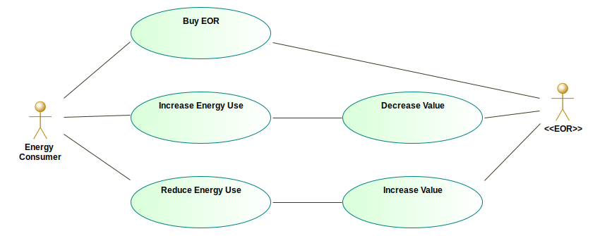

The Ethereum community has developed a variety of platform standards, called Ethereum Improvement Proposals (EIPs), which include core protocol specifications, client application programming interfaces and smart contract specifications. If an EIP is approved, it becomes an Ethereum Request for Comment (ERC), which give technical guidance to standard interfaces. An example is ERC20 [^2], a contract interface for creating fungible assets. Fungibility is a term from economics that relates to an items' ability to be exchanged for something else; fungible goods, such as Ether or The U.S. Dollar, are equivalent and interchangeable, whereas non-fungible goods, such as deeds of ownership or collectables, are distinct [@OpenZeppelin_TokensOpenZeppelinDocs_2019]. Therefore, ERC20 derived contracts define tokens that represent a form of digital asset that can act as a medium of exchange on the Ethereum network; [EOS](https://eos.io/) [^3], [Augur](https://www.augur.net/) [^4] and [0x](https://0x.org/) [^5] are three examples of Ethereum tokens.

The ERC777 standard maintains backwards compatibility with ERC20 but includes significant improvements. For example, it has more sophisticated mechanisms for sending and receiving tokens [^6]. Figure 1, below, shows that [Enervator](https://github.com/glowkeeper/Enervator), which has a token symbol EOR, inherits from OpenZeppelin's implementation of ERC777 (OpenZeppelin is a company that provides a set of production-ready contracts for Ethereum distributed application development) [^7].

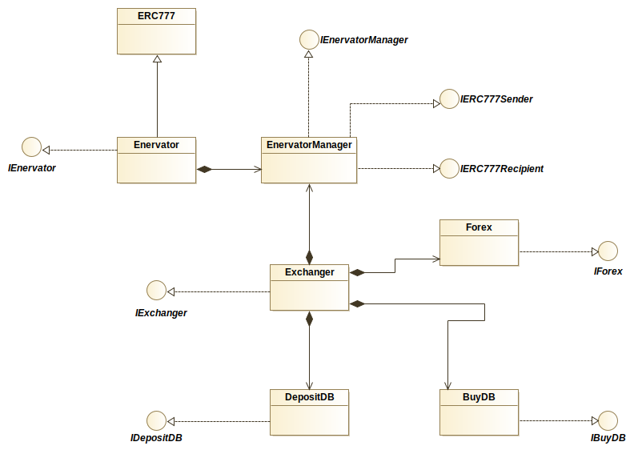

Figure 2 also shows that several other contracts support the token. [Enervator](https://github.com/glowkeeper/Enervator) also includes a management contract, _EnervatorManager_, which is the default operator of [Enervator](https://github.com/glowkeeper/Enervator) and holds the supply of the token. It also sets the parameters that derive EOR's value. EnervatorManager inherits from the OpenZeppelin contracts [IERC777Sender](https://github.com/OpenZeppelin/openzeppelin-contracts/blob/master/contracts/token/ERC777/IERC777Sender.sol) and [IERC777Recipient](https://github.com/OpenZeppelin/openzeppelin-contracts/blob/master/contracts/token/ERC777/IERC777Recipient.sol), which provide definitions of hook functions that _EnervatorManager_ implements. Those functions are called when EOR are sent or received. In particular, `EnervatorManager` implements the `tokensToSend` hook so that it calls a function from the `Exchanger` contract that updates the `BuyDB` contract with details of the tokens sent. As well as the `BuyDB` contract, the `Exchanger` contract maintains links to the `Forex` contract, which has functions that set and get the US Dollar exchange rates for sovereign currencies, and the `DepositDB` contract, which contains sovereign currency deposits. Those deposits govern the amount of EOR that can be bought.

### Consumption Metrics

The value of EOR is to reflect two annual consumption metrics. The first is global per capita energy consumption, which, according to figures from the World Bank, in 2014, was 1922.488 kilograms of oil equivalent, or 22.35853544 MegaWatt hours (MWh) [^8].

The second consumption metric is total primary energy supply (TPES), which according to the International Energy Agency (IEA), in 2016, was 13972 Megatons of oil equivalent (Mtoe), or 162,494,360,000 MWh [@InternationalEnergyAgency_WorldEnergyBalances_2019].

Since the basis of the value of EOR is global energy use per capita, it seems prudent to base total supply on world population. At the time of writing, that was 7,727,623,693 [^9].

Finally, so that it is possible to exchange sovereign currencies for EOR, a sovereign currency price per MWh is needed. Energy prices vary significantly around the world; however, figures from the IEA show that, for 2017, the _global average residential electricity price_ was US$98.16 per MWh [^10].

### Value Algorithms

The value of EOR will reflect energy consumption, not energy price variations, so [Enervator](https://github.com/glowkeeper/Enervator) shall use the 2017 global average residential electricity price, at US$98.16 per MWh, as a constant.

A simple value algorithm would be to derive the value of a single EOR by taking the product of US$98.16 and annual global average per capita energy consumption. For example:

1 EOR = 98.16 * 22.35853544 = US$2194.71

Unfortunately, that simple algorithm rewards inefficiency, since the value of EOR would increase as consumption increases. In a world threatened by climate change, that is problematic. Instead, a simple fix that offers incentives for efficiency is to take the reciprocal of the annual global average per capita energy consumption:

1 EOR = 98.16 * ( 1 / 22.35853544 ) = US$4.39

To further incentivise lower energy consumption, the price of a single EOR also reflects the difference between the old and the current TPES figures. To see the effect, imagine the annual TPES figures show that, unfortunately, TPES has increased from 162,494,360,000 MWh to 200,000,000,000 MWh:

1 EOR = 98.16 * ( 1 / 22.35853544 ) * ( 162494360000 / 200000000000 ) = 98.16 * ( 162494360000 / 200000000000 ) / 22.35853544  = US$3.57

Hence, with an increase in TPES, the value of EOR decreases, and visa-versa.

## Enervator Deployment

At the time of writing, [Enervator](https://github.com/glowkeeper/Enervator) is available on Ethereum's Rinkeby test network [^11]. Figure 3, below, shows Enervator on Rinkeby, shortly after its deployment; amongst the details shown are the physical address of the Enervator contract, the token supply, the number of addresses holding EOR and some initial transfers.

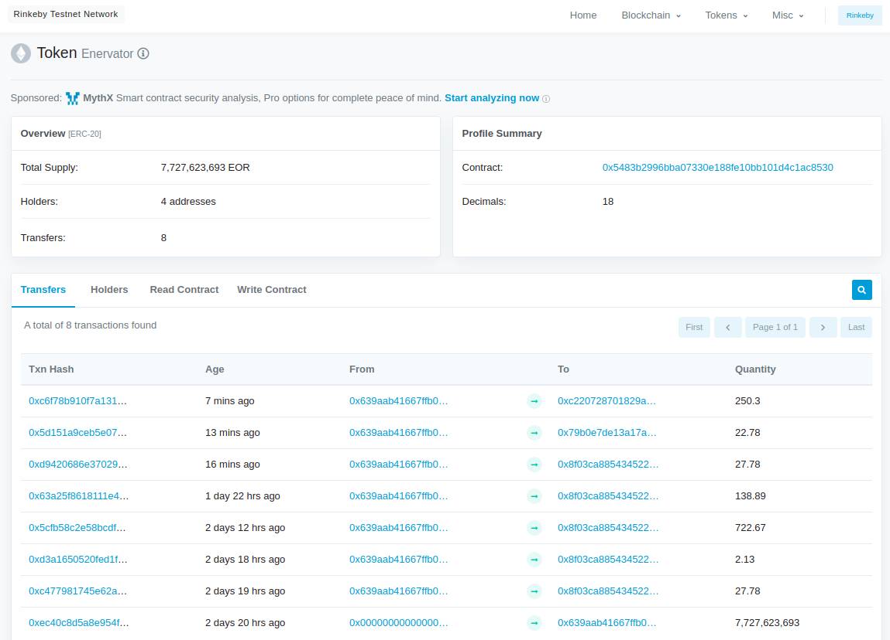

## An Application to Administer Enervator

The author has developed an application called Eneradmin [^12], which is a proof of concept to demonstrate administering Enervator. Eneradmin is a web-based application written in the Javascript framework React [^13]. It depends on the web browser extension MetaMask [^14], which is cryptocurrency wallet software that manages Ethereum accounts and thereby, allows users to sign and pay for smart contract transactions created by Ethereum applications.

Figure 4 shows that Eneradmin is responsible for managing the supply of EOR, as well as setting the token's value parameters and the sovereign currency US Dollar exchange rates. Enerchanger, the DSR artefact described later, is responsible for converting those exchange rates into their equivalent EOR value.

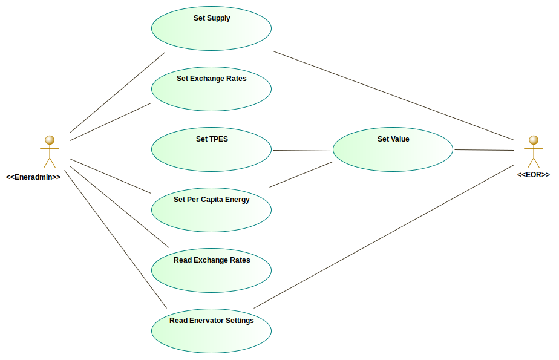

The scenario described below models the values described above. Figure 5 shows that, at creation, EOR's total supply was 7,727,623,693 tokens, matching the global population for September 2019. It was initialised with a constant per MWh price of US$98.16, and TPES was set at 162,494,360,000 MWh. Per capita energy was set to 22.36 MWh. That results in the value of a single EOR at US$4.39:

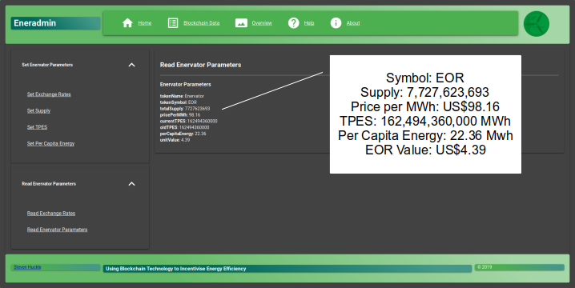

Next, Figure 6 shows the author using MetaMask, via Eneradmin, to sign the transaction that changes EOR's setting for global per capita energy consumption to 30 MWh.

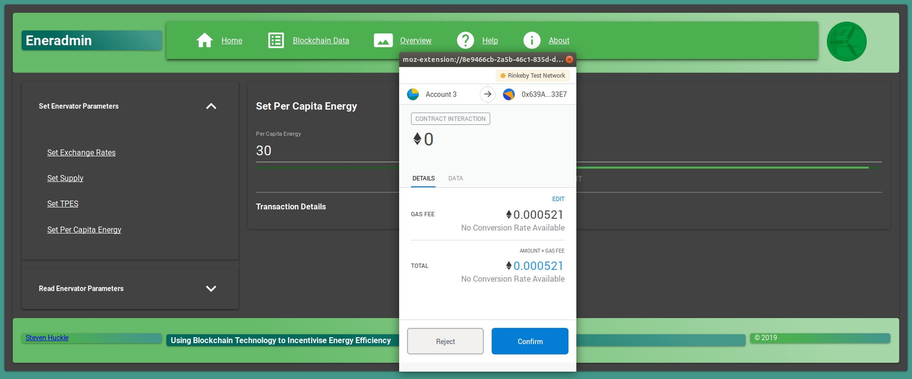

Consequently, Figure 7 shows that EOR's value has dropped to US$3.27.

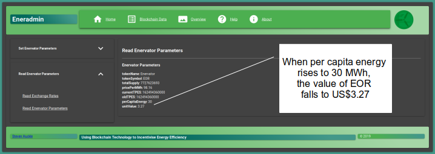

However, Figure 8 shows that, if global per capita energy consumption falls to 10 MWh, the value of EOR rises to US$9.82.

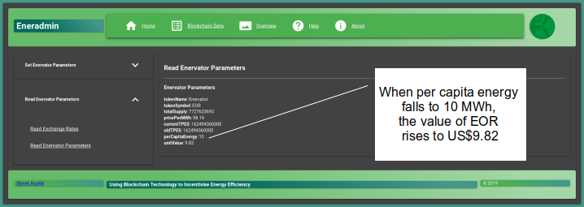

The result is that holders of EOR have a stake in seeing global per capita energy consumption fall, and therefore, it offers incentives for lowering their personal energy use, too.

Figures 9 and 10 show a similar mechanism for TPES. Figure 9 shows that with per capita energy consumption set back to its initial amount of 22.36 MWh, but annual TPES rising to 200,000,000,000 MWh, the value of EOR falls to US$3.57.

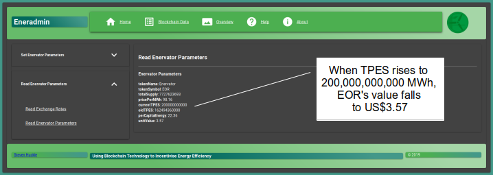

However, Figure 10 shows that, if TPES falls to 100,000,000,000 MWh instead, EOR's value rises to US$7.13.

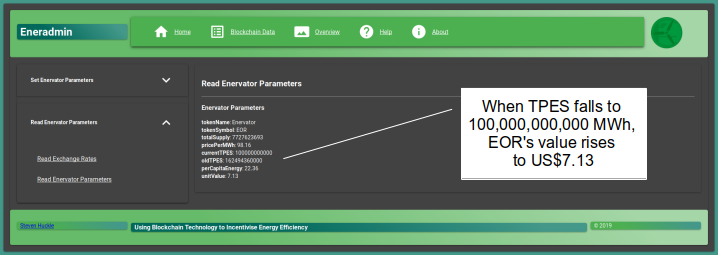

Hence, energy producers are similarly incentivised to decrease the amount of energy they produce.

## Exchanging Sovereign Currencies for EOR

The author has developed an application called Enerchanger [^16], which is a proof of concept to demonstrate exchanging sovereign currencies for EOR. Similar to Eneradmin, Enerchanger is a web-based application that depends on the web browser extension MetaMask. Figure 11 shows that Enerchanger is responsible for taking sovereign currency deposits and exchanging those for EOR.

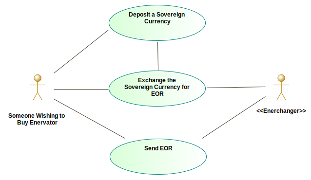

Figure 12, below, shows that Enerchanger retrieves exchange rates from the Forex contract in which Eneradmin, described above, stores those rates. It interacts with that contract via an Exchanger contract that also interacts with contracts which store cash deposits and purchases of EOR.

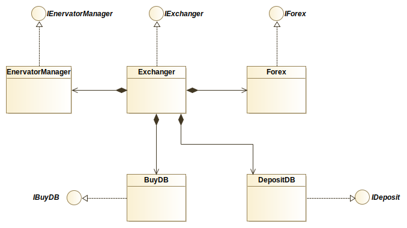

The scenario below imagines an Indian national exchanging her Rupees for EOR. First, Figure 13, below, shows the exchange rates that Eneradmin has stored. These are the rates per U.S. Dollar, not per EOR.

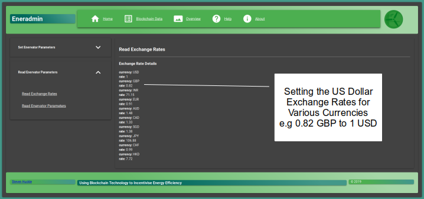

Next, Figure 14 shows a scenario whereby an Indian citizen uses the functionality of Enerchanger to deposit 10,000 Rupees, which she can later exchange for EOR. The deposit shown is a simulation of a web-based service that could easily be fulfilled by an online payment service provided by a company such as Visa, Mastercard, or PayPal.

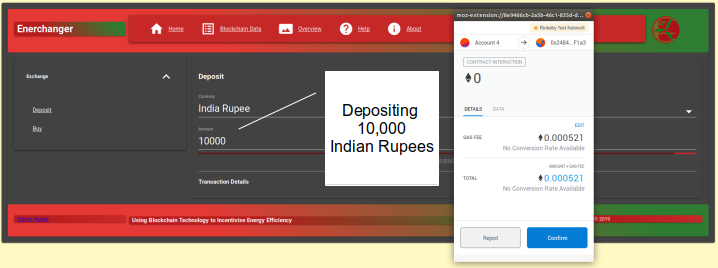

Figure 15 shows the Indian Citizen about to sign the transaction that exchanges her deposit for EOR. When buying EOR, Enerchanger displays the deposit reference, the type of currency deposited and the amount deposited. It also displays the U.S. Dollar exchange rate for that currency, the U.S. Dollar value of EOR and the deposited currency to EOR exchange rate. Finally, displayed is the amount of EOR to be bought.

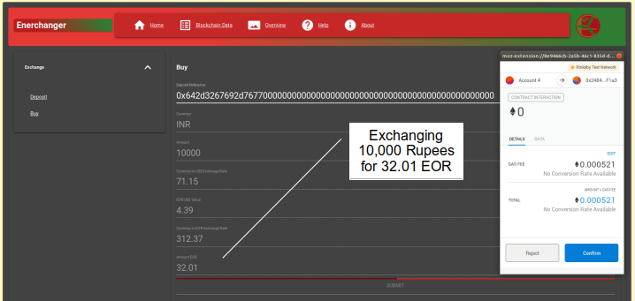

Figure 16 shows the Indian Citizen's MetaMask wallet container her newly bought 32.01 EOR.

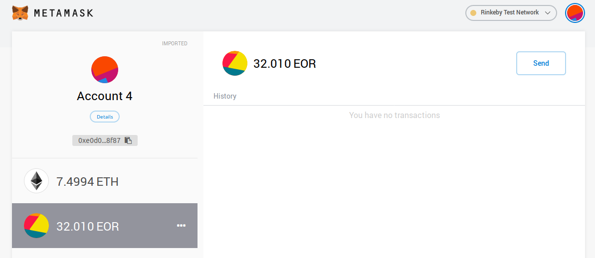

Finally, Figure 17 shows that transfer on the Rinkeby blockchain explorer service, Etherscan (it is the first transfer displayed) [^701].

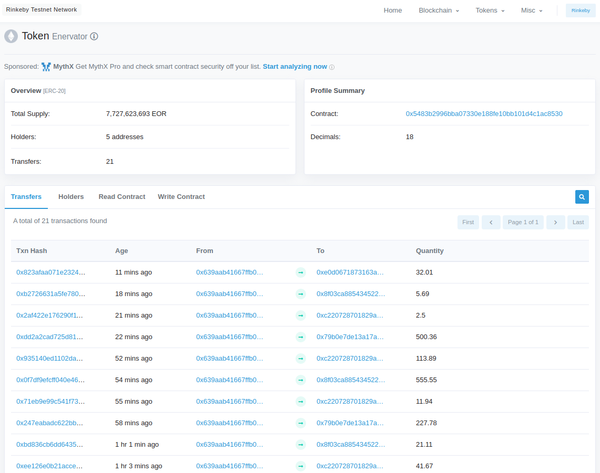

## Analysis

[Enervator](https://github.com/glowkeeper/Enervator) demonstrates that, by offering incentives for enabling more energy-efficient behaviour, blockchains include the mechanisms to help address concerns about how much energy the technology consumes during mining. Indeed, [Enervator](https://github.com/glowkeeper/Enervator) has the potential to have a positive impact on energy efficiency and thereby help avert the climate emergency [@BBCNews_UKParliamentDeclares_2019] and increase the likelihood of humanity achieving a degree of longevity. Furthermore, exchanging sovereign money for cryptocurrencies may have other benefits, including increasing financial transparency.

Imagine that both consumers and producers hold EOR and that their efficiencies result in the value of EOR rising. In such a case, consumers benefit directly, and producers are compensated even though consumers are no longer consuming their products. Thus, by benefiting consumers, producers and the climate, the value mechanisms of [Enervator](https://github.com/glowkeeper/Enervator) help increase 'total social welfare' [@Policonomics_SurplusPoliconomics_2017].

Ultimately, since the effect of an individual lowering their consumption will have next-to-no sway on global per capita energy consumption, the success of EOR will rely on network externalities [@Katz_SystemsCompetitionNetwork_1994]. Many people must hold the token, but that should amplify uptake. After all, existing holders of EOR will benefit when the number of other people holding EOR increases because that should drive the energy-efficient behaviour necessary to increase the value of the token. In turn, when people see EOR's price rising, that must result in more people buying the token, leading to more people becoming energy efficient, further increasing the value of EOR, and so on. Hence, the network effects of EOR realise the benefits of energy efficiency because its incentives help to internalise the negative external environmental impacts caused by energy consumption, consequences that have lead to many governmental organisations around the world declaring an ecological emergency [@BBCNews_UKParliamentDeclares_2019]. Thus, EOR offers people an opportunity to believe that their actions are no longer inconsequential in addressing climate change. That has to be positive.
Wide-scale adoption of new technologies is not without precedent? An October 2019 survey found that 2% of American adults hold Bitcoin. Additionally, a further 7.3% were planning on buying some [@SarahBauder_LargestBitcoinOwnership_2019]. While those numbers may not appear significant, consider that cryptocurrencies are just ten years old; when the Internet was of a similar age, global penetration was around 5.8%, whereas now, at forty years old, the Internet is used by over 50% of the planet [@CaneIslandAlternativeAdvisors_WhyBitcoinNever_2019].

There may be other benefits to the wide-scale adoption of a cryptocurrency such as EOR. First, the decentralised nature of crypto's removes the counterparty risk of traditional sovereign currencies, where a depositor putting funds in their bank is effectively trading their cash for the bank's digital promise to redeem that deposit for the same value and to do so on-demand [@Gehring_HowRippleWorks_2014]. Martin defines such deposits as a particular type of transferable credit that creates an ephemeral and entirely cosmetic "unit of trust" [@Martin_MoneyUnauthorisedBiography_2014]. That transfer relies on the clearing of credit accounts. Therefore, notes and coins are tokens of an underlying debtor relationship, based on a pledge that is made apparent on U.K. banknotes, which declare, "I promise to pay the bearer on demand the sum of twenty pounds". Ordinarily, that promise works very well. However, it does not work quite so well in extraordinary times, when financial shocks question the viability of those units of credit. That happened in 2008 with the onset of a profound economic crisis caused by the elaborate financial schemes of a 'shadow banking sector' [@pozsar_nonbank-bank_2011], when people around the world realised that not much certainty lay behind all the rules, regulations, and systems of sovereign cash [@rifkin_zero_2014]. Unfortunately, the shock caused the traditional banking sectors of many countries to show signs of financial distress, requiring state provision of direct credit support to maintain public trust in their sovereign currency [@Huckle_SocialismBlockchain_2016]. By the end of 2009, the extent of the State's support during the crisis was estimated to total more than US$14 trillion, or almost a quarter of the global economy [@alessandri_banking_2009]. Was it a coincidence that the release of Bitcoin came during the depths of that crisis, when people began to distrust traditional state-backed currencies, such as the U.S Dollar? After all, Bitcoin promised an alternative [@Huckle_SocialismBlockchain_2016].

Moving physical cash into the cryptocurrency space increases the visibility and availability of financial information. Blockchains are publicly viewable, and so all of its transactions are traceable algorithmically. Furthermore, the records are practically impossible to change  [@Savelyev_CopyrightBlockchainEra_2018]. An example of that traceability is displayed in Figure 18, below, which shows EOR records held on the publicly viewable Rinkeby blockchain. It describes the address holding those 32.01 EOR, bought in Figure 17, above. The holder has subsequently transferred some of her tokens to other addresses - perhaps she has bought something or transferred the currency to an elderly-relative living in abroad. Indeed, any transaction involving that same address will feature similarly transparency, which could have beneficial implications for regulators and tax authorities alike.

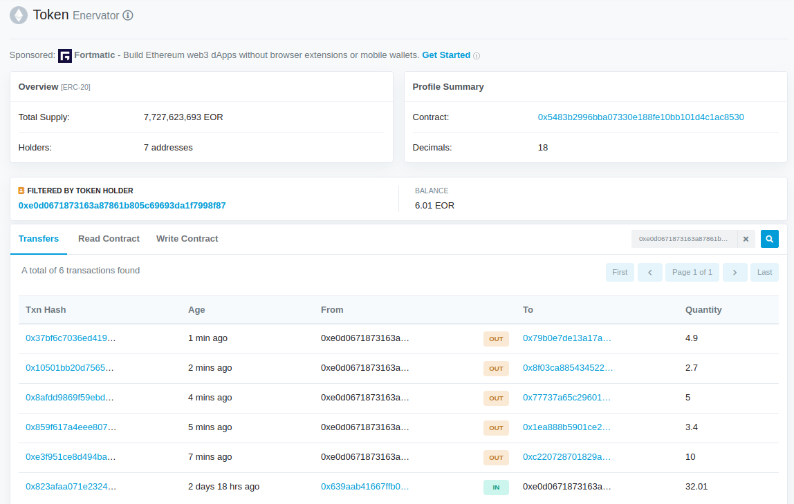

June 2019 saw the announcement of the Libra Association (which features some of the world's largest corporations, the most prominent of which was Facebook). Their white paper published plans for a 2020 launch of a decentralised open-source blockchain, smart contract platform and low-volatility cryptocurrency called Libra [@LibraAssociation_LibraWhitePaper_2019]. The paper argues that blockchain technology has unique properties for becoming a public good because it addresses problems with financial services' accessibility and trust, issues that result in 1.7 billion adults remaining unbanked globally. That is despite one billion of those adults having access to a mobile phone, and half-a-billion having internet access. Part of the problem lies in the high cost of money transactions, such as remittances, ATM withdrawals and loans. Libra believes its global financial infrastructure and digitally native currency can overcome such issues. It is purported to introduce stability, low inflation, global acceptance and fungibility, thus enabling, "access to better, cheaper, and open financial services — no matter who you are, where you live, what you do, or how much you have" [@LibraAssociation_LibraWhitePaper_2019]. Nakamoto's original paper on Bitcoin, which introduced the world to the idea of cryptocurrencies, made similar claims when it proposed a system for electronic transactions that negated the need for centralised systems of trust, thereby reducing transaction costs [@Nakamoto_BitcoinPeertoPeerElectronic_2008].

Despite the benefits cryptocurrencies offer, many countries have legislated against them. The reason for that may be many; it could be that by allowing cryptocurrencies, governments would have to forgo _seigniorage_, which is the revenue earned by issuing the currency. That occurs in several ways, but the most important is the profit made due to differences between production and distribution costs and the value of money itself [@bank_of_canada_seigniorage_2013]. Legislation against cryptocurrencies may also be due to issues of monetary sovereignty, which is the Government's right to exercise exclusive control over the supply of currency, giving it the ability to control the nation's inflation rate and overall financial stability [@Huckle_PostcashSocietyApplication_2017]. The importance of the nation-state retaining its ability to exercise exclusive control over the supply of currency was recognised in Ancient China, "Whoever wished to remain in power and see his domain well-governed should jealously guard the management of the monetary standard and the monopoly of issuance" [@Martin_MoneyUnauthorisedBiography_2014]. The nation-state has many advantages as an issuer of money. Firstly, they conduct by far the most significant volume of economic transactions. Second, they have political authority. Finally, they have legitimacy, which is essential because sovereign money relies upon a government promise to match its value with equivalent new notes [@Martin_MoneyUnauthorisedBiography_2014]. That is not to say that such legitimacy is not open to question, as has been shown above.

However, governments have already surrendered much of their sovereign power over money creation to corporate lenders [@Mellor_NeoliberalismHasTricked_2019]. Mellor explains how, when describing the ecologically damaging debt mechanisms of Capitalism, whereby the need to repay interest on that debt drives excessive growth because it necessitates increasing productive capacity and, inevitably, that puts pressure on natural resources [@Mellor_NeoliberalismHasTricked_2019]. That relationship between debt and money creation also has repercussions for traditional function of banks, who used to profit by passing on savers' deposits to borrowers because they were able to charge debtors more interest than that given to savers. However, in the last decade, monetary authorities have acknowledged that it is a popular misconception to hold such a view of modern banks, as the direct link between savings and deposits has mostly disappeared. Instead, the lending practices of private banks create much of the new money of modern economies [@McLeay_MoneyCreationModern_2014]. In that context, the announcement of the Libra cryptocurrency was fascinating; after all, it is another example of large corporations attempting to wrest control of currency issuance. It is precisely that which troubles commentators such as Clarke, who, although lauding its proposition to foster positive innovation, widen access to financial services, and give people greater control over their money, worry about ceding control to a cartel of private companies [@Clarke_WhyWeMust_2019]. Indeed, policymakers around the world have been sceptical of the announcement of Libra. For example, French Finance Minister Bruno Le Maire confirmed this author's suspicion that it was sovereignty preventing the adoption of cryptocurrencies. He argued for legislating against Libra because it has the potential to disempower a country's ability to constrain inflation.

Nevertheless, despite reluctance, there is nascent international government support for cryptocurrencies. For example, Argentina allows people to top up their state public transport cards with Bitcoin, and the Gibraltar Blockchain Exchange allows its citizens to trade cryptocurrencies, such as Bitcoin and Ethereum [@Arisandi_CountriesThatAre_2019]. In December 2017, the President of Venezuela, Nicolas Maduro, announced that the country would adopt the Petro or Petromoneda, a new national digital cryptocurrency, that would be backed by the country's natural resources, such as oil and gas [@Krygier_VenezuelaLaunchesPetro_2018]. Hence, governmental cryptocurrency support is not without precedent, despite consequences for monetary sovereignty. In that regard, EOR has supply mechanisms that would allow the Indian government to control inflation were it to consider the extraordinary step of adopting a version of the token as its national currency. Currently, EOR's total supply relates to the global population. However, that need not be so; there would be nothing to stop India fixing the token's supply to match the total supply of their current sovereign currency. That idea of national cryptocurrency adoption has support elsewhere; indeed, Clarke argues that rather than relying on Libra, society needs governments to deploy digital currencies in the public interest [@Clarke_WhyWeMust_2019].

## Future Work and Limitations

[Enervator](https://github.com/glowkeeper/Enervator) may represent an inherent contradiction. If the CBPP practices of blockchains represent an opportunity to undermine the inequality of Capitalism (and its associated industrial carbon pollution), then even if the token incentivises energy efficiency, it cannot offer a solution to those systemic failures if it supports the very mechanisms that have introduced such failures. The author's paper, Socialism and the Blockchain [@Huckle_SocialismBlockchain_2016] may offer an alternative approach. There, he explains that, instead of money, Marx envisaged a system of labour certificates, whereby people get rewarded according to the number of hours they spend in production. Those certificates could be used to buy all merchandise at cost price; goods whose value is determined in hours of labour [@petr_kropotkin_anarchism:_1898]. Such certificates would not be allowed to circulate, so they could not be considered as _capital_ because Marx believed it was the money-commodity-money credit cycle that was core to Capitalist society [@karl_marx_capital:_1887]. That is because that cycle provides liquidity [@arnold_marx_1989], and indeed, one of the foremost Economists of the 20th Century, John Maynard Keynes, thought liquidity as paramount to Capitalist economies because it made it possible to increase the means of production very quickly [@chang_economics:_2014]. Socialism and the Blockchain proposes native digital assets that are used as Marxist labour certificates in support of a labour theory of value by matching the quantity of energy used in creating the asset with the amount of energy used by products over their lifetime [@Huckle_SocialismBlockchain_2016]. Such certificates could be used to purchase products, but a smart contract would then remove them from circulation so they would not provide liquidity. If it is true that by introducing yet another means of liquidity, [Enervator](https://github.com/glowkeeper/Enervator) helps prop up those same systems that are causing so much destruction, might labour certificates be more inline with a blockchain-based CBPP approach to climate change? However, although that could be a fascinating avenue in which to take further research, it might also represent unrealisable Utopian thinking. After all, society appears a long way from organising on Socialist principles; it is Capitalism that predominates. Hence, we should try and improve that system; the author contends that [Enervator](https://github.com/glowkeeper/Enervator) might represent one small improvement.

Could there be unintended consequences of [Enervator](https://github.com/glowkeeper/Enervator)? By internalising problematic network externalities, could there be negative psychological impacts? Might the token generate some unwanted behaviour, such as the token holder not turning on the heating, even when the outside temperatures determine that the heating should go on. Such matters are only addressable through extensive testing of future iterations of the token.

Is the algorithm currently implemented by [Enervator](https://github.com/glowkeeper/Enervator) too simplistic? Could it offer better incentives? The author's article for The Conversation [^1005] concluded that "if humankind is to avoid climate catastrophe, we need to take urgent action and find solutions that produce clean, sustainable energy" [@Huckle_BitcoinHighEnergy_2018]. [Enervator](https://github.com/glowkeeper/Enervator) could incentivise clean energy, too. For example, if annual wind power grows, the token's value increases. Again, improvements to the value algorithm of [Enervator](https://github.com/glowkeeper/Enervator) can only occur through extensive testing.

This article proposes that EOR increases the visibility and availability of financial information. However, the cryptographic capabilities inherent in blockchain technology make it challenging to match transactions to real people [@karlstrom_libertarians_2014]. That challenge is not insurmountable, especially if the Indian Government were to adopt EOR, whereby it was in charge of issuing the necessary addresses for trading the token.

Finally, during a presentation for an Innovation forum discussing Energy Services Business Models, held by the [UK Centre for Research into Energy Demand Solutions](http://www.sussex.ac.uk/spru/research/projects/creds) at [The Fusebox, Brighton](https://thefuseboxbrighton.com/) on October 4th 2019 [^1001], this author discussed the barriers to uptake in front of [Enervator](https://github.com/glowkeeper/Enervator). A slide showed the network externalities discussed in this thesis, whereby the hoped-for energy-efficient behaviour might only become apparent if the token managed wide-scale adoption. However, the person in charge of energy services at a UK county council had presented before the author, during which they explained they were seeking innovative solutions to lowering their consumption. The author offered [Enervator](https://github.com/glowkeeper/Enervator) as one such innovation. Could the solution to those network externalities come in the form of scaling back the goals of [Enervator](https://github.com/glowkeeper/Enervator)? Instead of incentivising global efficiencies, might it incentivise the energy consumption of that county council? The person in charge of the county council's energy services seemed to think so, and initial conversations about the idea appear promising.

## Conclusion

This article describes the cryptocurrency token [Enervator](https://github.com/glowkeeper/Enervator), whose primary goal is to incentivise energy efficiency. By describing that token, it examines whether blockchains can help address concerns about energy consumption.

The article gave some background to [Enervator](https://github.com/glowkeeper/Enervator) and described the token's design. Then it explained the design of the proof of concept that administers EOR - Eneradmin. It explained examples of that application in use. Those examples showed Eneradmin setting the parameters that change the value of EOR in such a manner as to increase or decrease the token's value, depending on the decrease or increase of global per capita energy consumption and TPES. Then this article gave some background to the proof of concept Enerchanger and described its design. It showed examples of that application in use and how it might be used to deposit Indian Rupees and exchange those for EOR. The chapter ended with an analysis of those examples, whereby it found that blockchains, through EOR, can indeed help address concerns about energy consumption.  That depends on network externalities because only wide-scale adoption of EOR will see that potential realised. There could be other benefits of adopting cryptocurrencies, such as increasing the transparency of financial information and widening access to financial services.  However,  there are concerns over monetary sovereignty because cryptos introduce the possibility of disempowering a country's ability to constrain inflation. One way to overcome such concerns might be for governments to issue cryptocurrencies of their own, but as of the time of writing, there are very few examples of such bold moves.

[^1]: The source code for [Enervator](https://github.com/glowkeeper/Enervator) is available on GitHub at https://github.com/glowkeeper/Enervator
[^2]: The ERC20 token standard is described at https://github.com/ethereum/eips/issues/20
[^3]: EOS has the currency code EOS. More information about EOS is available at <https://eos.io/>
[^4]: Augur has the currency code REP. More information about Augur is available at https://www.augur.net/
[^5]: 0x has the currency code ZRX. More information about Ox is available at https://0x.org/
[^6]: The ERC777 token standard is described at https://github.com/ethereum/eips/issues/777
[^7]: OpenZeppelin's ERC777 contract is defined at https://github.com/OpenZeppelin/openzeppelin-contracts/blob/master/contracts/token/ERC777/ERC777.sol
[^8]: World Bank statistics for energy use per capita are available at https://data.worldbank.org/indicator/EG.USE.PCAP.KG.OE
[^9]: World population available at https://www.worldometers.info/world-population/
[^10]: IEA statistics for global average residential electricity price are available at https://www.iea.org/statistics/prices/
[^11]: The address of the [Enervator](https://github.com/glowkeeper/Enervator) token is on the GitHub repository at https://github.com/glowkeeper/Enervator
[^12]: The address of the live demonstration of the Eneradmin proof of concept is available on the [Enervator](https://github.com/glowkeeper/Enervator) GitHub repository at https://github.com/glowkeeper/Enervator
[^13]: React is available at https://reactjs.org/
[^14]: MetaMask is available at https://metamask.io/
[^15]: The Conversation - https://theconversation.com - is a not-for-profit organisation. They source topical content, written by academics, that is written in plain English and aimed at the general public
[^16]: The address of the live demonstration of the Enerchanger proof of concept is available on the [Enervator](https://github.com/glowkeeper/Enervator) GitHub repository at https://github.com/glowkeeper/Enervator
