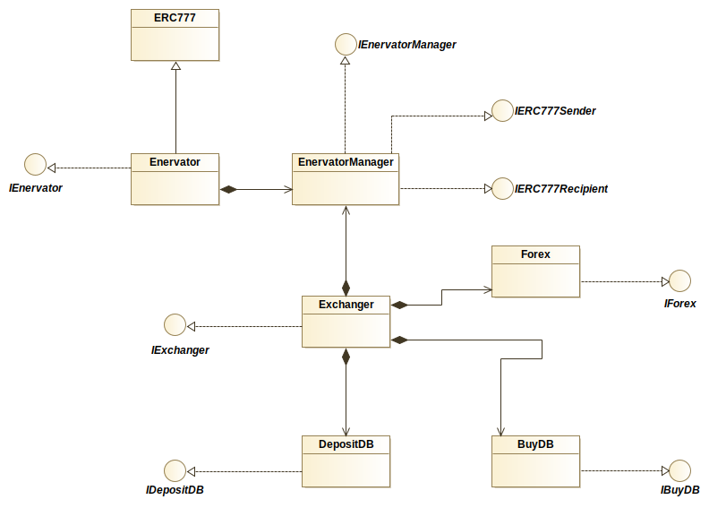
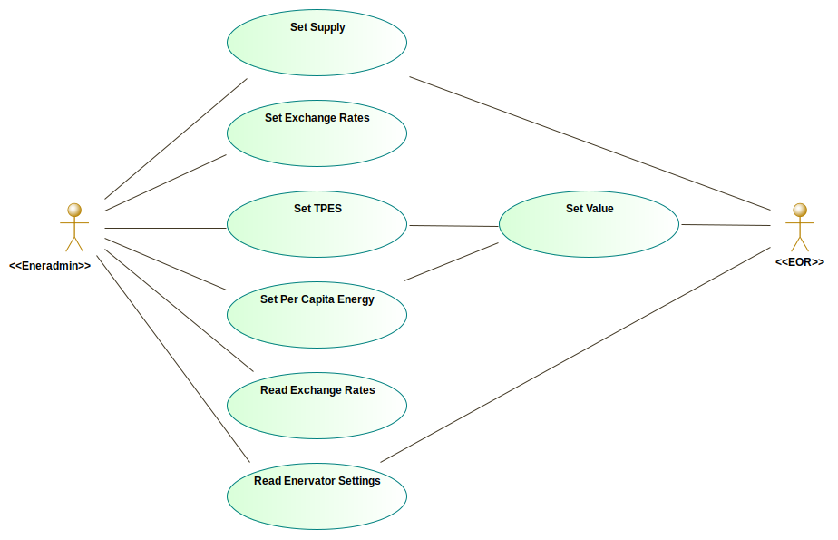
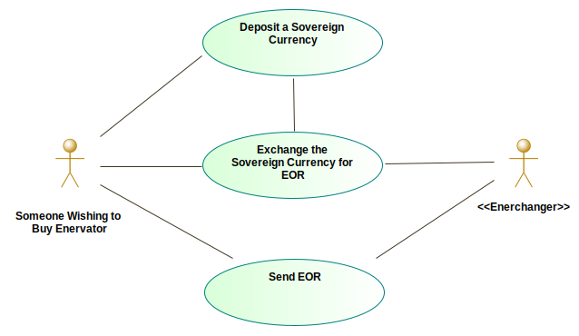

# Technical Overview of Enervator

Below is a technical overview of [Enervator](https://github.com/glowkeeper/Enervator).

_*Enervator is described in more detail in [Steve Huckle's PhD Thesis](https://glowkeeper.github.io/PhDWorks/). Some of the information here borrows excerpts from that work._

[Enervator](https://github.com/glowkeeper/Enervator), which has a token symbol EOR, is an ERC777 token contract that inherits from OpenZeppelin's implementation of [ERC777](https://github.com/OpenZeppelin/openzeppelin-contracts/blob/master/contracts/token/ERC777/ERC777.sol). Its aim is to incentivise energy efficiency. Figure 1, below, shows that the token is supported by a number of other contracts. They chiefly manage the supply and value of EOR and allow the token to be exchanged for sovereign currencies.

_Figure 1: Enervator class diagram_

`EnervatorManager` is the default operator of [Enervator](https://github.com/glowkeeper/Enervator). It holds the supply of EOR and sets the parameters that derive EOR's [value](./value.md). `EnervatorManager` inherits from OpenZeppelin interfaces, [IERC777Sender](https://github.com/OpenZeppelin/openzeppelin-contracts/blob/master/contracts/token/ERC777/IERC777Sender.sol) and [IERC777Recipient](https://github.com/OpenZeppelin/openzeppelin-contracts/blob/master/contracts/token/ERC777/IERC777Recipient.sol), which provide definitions of hook functions that `EnervatorManager` implements. Those functions are called when EOR are sent or received. In particular, `EnervatorManager` implements the `tokensToSend` hook so that it calls a function from the `Exchanger` contract that updates the `BuyDB` contract with details of the tokens sent. As well as the `BuyDB` contract, the `Exchanger` contract maintains links to the `Forex` contract, which has functions that set and get the US Dollar exchange rates for sovereign currencies, and the `DepositDB` contract, which contains sovereign currency deposits. Those deposits govern the amount of EOR that can be bought.

## Frontend Interfaces

[Enervator](https://github.com/glowkeeper/Enervator) is interfaced by two demo' projects (please read the [loading section](#loading), below, before trying to load the apps' in your browser):

1. [Eneradmin](http://bcd1e0c422401c3591fb3a347aaa0d73b7faff797a21b15edabf0ca214157ccb)
2. [Enerchanger](http://795f83fa1356cd7d00e5cfe8f1a93f32c55127684c6fc4cb8ff89a32e000016b)

`Eneradmin` is responsible for managing [Enervator](https://github.com/glowkeeper/Enervator). It mainly interacts with the `EnervatorManager` contract, described above. Figure 2, below, shows that it manages the supply of EOR, as well as setting the token's value parameters and the sovereign currency US Dollar exchange rates. You do not (should not) have permissions to set any parameters with [Eneradmin](http://bcd1e0c422401c3591fb3a347aaa0d73b7faff797a21b15edabf0ca214157ccb), but you will be able to read both the token's parameters and any exchange rates that have been specified.

_Figure 2: Eneradmin use case diagram_

`Enerchanger` converts those exchange rates into their equivalent EOR value. It mainly interacts with the `Exchanger` contract, described above. Figure 3, below, shows that it is a proof of concept that simulates depositing cash and buying EOR. To use `Enerchanger`, first deposit some cash (imagine that's a PayPal link or some such like), then use that deposit to buy some EOR.

_Figure 3: Enerchanger use case diagram_

Both `Eneradmin`and `Enerchanger` are web-based applications written in [React](https://reactjs.org/). They employ a [Redux](https://redux.js.org/) state container that govern interaction with Ethereum via [ethers.js](https://github.com/ethers-io/ethers.js/), which uses [web3.js](https://github.com/ethereum/web3.js/) as a provider, via the browser extension [MetaMask](https://reactjs.org/). They also implement type-safety through [Typescript](https://www.typescriptlang.org/). `Eneradmin`and `Enerchanger` are built and bundled using [webpack](https://webpack.js.org/).

## Deployment

Enervator is deployed at address [0x5483b2996BBa07330E188Fe10BB101d4c1Ac8530](https://rinkeby.etherscan.io/token/0x5483b2996bba07330e188fe10bb101d4c1ac8530) on Ethereum's Rinkeby Test Network.

The `webpack` bundled apps </a>[Eneradmin](http://bcd1e0c422401c3591fb3a347aaa0d73b7faff797a21b15edabf0ca214157ccb) and [Enerchanger](http://795f83fa1356cd7d00e5cfe8f1a93f32c55127684c6fc4cb8ff89a32e000016b) are deployed to [dat](https://dat.foundation/), which is a peer-to-peer distributed data protocol. They are kept online via [homebase](https://github.com/beakerbrowser/homebase), which is daemonised, via [pm2](https://www.npmjs.com/package/pm2), on a server with the [dat](https://github.com/datproject/dat) tools installed.

An alternative to [dat](https://dat.foundation/) is [ipfs](https://ipfs.io/). However, [in this author's opinion](https://glowkeeper.github.io/), [dat](https://dat.foundation/) is significantly easier to deploy and maintain than [ipfs](https://ipfs.io/), not least because, with [dat](https://dat.foundation/), you can copy new files to the same directory, and keep the same hash address. With [ipfs](https://ipfs.io/), new files means new hashes (although, _I think_ there are ways to use DNS to circumvent that). Additionally, [this author](https://glowkeeper.github.io/) struggled to keep [ipfs](https://ipfs.io/) resources pinned and online, whereas [homebase](https://github.com/beakerbrowser/homebase) manages that seamlessly. Finally, [dat](https://dat.foundation/) appears much less _corporate_ than [ipfs](https://ipfs.io/).

_*Disclaimer: [this author](https://glowkeeper.github.io/) hasn't looked at [ipfs](https://ipfs.io/) for a while, so some of that described above may no longer be true._

## Loading Eneradmin and Enerchanger

<a name='loading'>To load </a>[Eneradmin](http://bcd1e0c422401c3591fb3a347aaa0d73b7faff797a21b15edabf0ca214157ccb) and [Enerchanger](http://795f83fa1356cd7d00e5cfe8f1a93f32c55127684c6fc4cb8ff89a32e000016b) in a web browser, you will need to be running [Firefox](https://www.mozilla.org/) with the [Dat P2P Protocol](https://addons.mozilla.org/en-GB/firefox/addon/dat-p2p-protocol/) and [MetaMask](https://metamask.io/) extensions installed. [MetaMask](https://metamask.io/) should be pointing at the Rinkeby Test Network, and you will need a few test Ether in your [MetaMask](https://metamask.io/) wallet - you can get those from the [Rinkeby Faucet](https://faucet.rinkeby.io/).

_Figure 4: The Enerchanger frontend interface_
