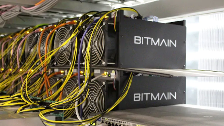

#  Enervator - Incentivising Energy Efficiency

by Steven Huckle

- - -

# The Energy Use of CryptoCurrencies

_Image Source: [CBC](https://www.cbc.ca/news/canada/montreal/magog-halts-bitcoin-mining-projects-over-energy-supply-concerns-1.4605041)_

- - -

# Counter Culture?

_Image Source: [The Daily Star](https://www.thedailystar.net/literature/news/karl-marx-india-assessment-part-ii-1683082)_

- - -

# Introducing Enervator

_Image Source: [Clipart Library](http://clipart-library.com/clipart/1071253.htm)_

- - -

## Overview

[Enervator](https://github.com/glowkeeper/Enervator) (EOR) is a proof of concept for a cryptocurrency that incentivises energy efficiency.

## Variables

[Enervator](https://github.com/glowkeeper/Enervator) currently uses four variables to derive value and govern supply.

1. Global per capita energy consumption
2. Total primary energy supply (TPES)
3. Global average residential electricity price
4. World population

## Variable (cont'd)

1. In 2014, _global per capita energy consumption_ was **22.36 MWh**.
2. In 2016, _TPES_ was **162494360000 MWh**.
3. For 2017, the _global average residential electricity price_ was **US$98.16 per MWh**.
4. At 2.34pm GMT on September 2nd, 2019, _world population_ was **7727623693**.

## EOR Value Mechanisms

Total Supply = World Population

EOR = 2017 global average residential electricity price * ( old TPES / current TPES ) / annual global per capita energy use

# Demo

_Image Source: [Clipart Library](http://clipart-library.com/clipart/1804638.htm)_

- - -

# Future Improvements

[Enervator](https://github.com/glowkeeper/Enervator) could incentivise renewable energy, too...

- - -

# Barriers to Uptake

> 1. Network effects
> 2. Technological barriers
> 3. Unintended consequences behind internalising externalities?
> 4. Any others?

- - -

# Summary

> 1. Criticisms of the excessive energy use of [Bitcoin](https://bitcoin.org/en/)
> 2. I argued it was a price worth paying because blockchains challenge the hierarchies of Capitalism
> 3. [Enervator](https://github.com/glowkeeper/Enervator) incentivises energy efficiency
> 4. There are (significant) barriers to uptake
> 5. ...but are they insurmountable?

- - -

# Links

1. [Introduction to this talk](https://github.com/glowkeeper/innovationForum): https://github.com/glowkeeper/innovationForum
2. [This presentation](https://tinyurl.com/y5f59m85): https://tinyurl.com/y5f59m85
3. [Socialism and the Blockchain](http://dx.doi.org/10.3390/fi8040049): http://dx.doi.org/10.3390/fi8040049
4. [Bitcoin’s high energy consumption is a concern – but it may be a price worth paying](https://tinyurl.com/y4ep8ygy): https://tinyurl.com/y4ep8ygy
5. [Enervator](https://github.com/glowkeeper/Enervator): https://github.com/glowkeeper/Enervator

- - -

# Thank You

w: [glowkeeper.github.io](https://glowkeeper.github.io/)

e: s.huckle@sussex.ac.uk
