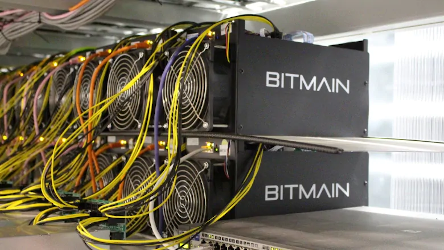
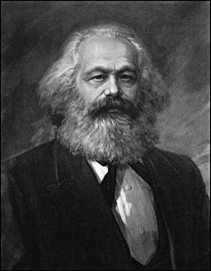
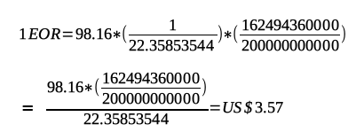

#  Enervator - Incentivising Energy Efficiency

by (Dr) Steven Huckle

- - -

# The Energy Use of CryptoCurrencies

_Image Source: [CBC](https://www.cbc.ca/news/canada/montreal/magog-halts-bitcoin-mining-projects-over-energy-supply-concerns-1.4605041)_

- - -

## Counter Culture?

_Image Source: [The Daily Star](https://www.thedailystar.net/literature/news/karl-marx-india-assessment-part-ii-1683082)_

## Circular Economy?

_Image Source: [STARSINSIDER](https://www.starsinsider.com/food/200230/a-greenhouse-full-of-crypto-tomatoes-is-being-heated-by-bitcoin-computers)_

# Introducing Enervator

_Image Source: [Clipart Library](http://clipart-library.com/clipart/1071253.htm)_

- - -

## 

[Enervator](https://github.com/glowkeeper/Enervator) (EOR) is a proof of concept for a cryptocurrency that incentivises energy efficiency

## World Population

At 2.34pm GMT on September 2nd, 2019: _7727623693_

## Global Average Per Capita Energy Consumption (GAPCEC)

In 2014: _22.36 MWh_

## Total Primary Energy Supply (TPES)

In 2016: _162494360000 MWh_

## Global Average Residential Electricity Price

In 2017: _US$98.16 per MWh_

## EOR Value - GAPCEC

## EOR Value - GAPCEC Rising

## EOR Value - TPES

# Demo

_Image Source: [Clipart Library](http://clipart-library.com/clipart/1804638.htm)_

- - -

## Video

<video controls=true src="http://localhost:8000/videos/test.m4v"></video>

# The Future

_Image Source: [Clipart Library](http://clipart-library.com/clipart/2083841.htm)_

- - -

## Improve the Algorithm

[Enervator](https://github.com/glowkeeper/Enervator) could incentivise renewable energy, too...

## Network Effects

A West Sussex Cryptocurrency?

# Summary

> 1. Criticisms of the excessive energy use of [Bitcoin](https://bitcoin.org/en/)
> 2. I argued it was a price worth paying because blockchains challenge the hierarchies of Capitalism
> 3. [Enervator](https://github.com/glowkeeper/Enervator) incentivises energy efficiency
> 4. There are (significant) barriers to uptake
> 5. ...but are they insurmountable?

- - -

# Links

1. [Introduction to this talk](https://github.com/glowkeeper/innovationForum): https://github.com/glowkeeper/innovationForum
2. [This presentation](https://tinyurl.com/y5f59m85): https://tinyurl.com/y5f59m85
3. [Socialism and the Blockchain](http://dx.doi.org/10.3390/fi8040049): http://dx.doi.org/10.3390/fi8040049
4. [Bitcoin’s high energy consumption is a concern – but it may be a price worth paying](https://tinyurl.com/y4ep8ygy): https://tinyurl.com/y4ep8ygy
5. [Enervator](https://github.com/glowkeeper/Enervator): https://github.com/glowkeeper/Enervator

- - -

# Thank You

w: [glowkeeper.github.io](https://glowkeeper.github.io/)

e: s.huckle@sussex.ac.uk
