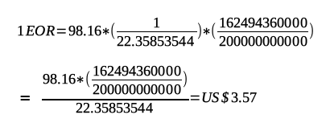

## All Views Expressed Are My Own


#  A Cryptocurrency that Incentivises Energy Efficiency


- - -

## The Energy Use of CryptoCurrencies


_Image Source: [CBC](https://www.cbc.ca/news/canada/montreal/magog-halts-bitcoin-mining-projects-over-energy-supply-concerns-1.4605041)_

## Counter Culture?


_Image Source: [The Daily Star](https://www.thedailystar.net/literature/news/karl-marx-india-assessment-part-ii-1683082)_

## Circular Economy?


_Image Source: [STARSINSIDER](https://www.starsinsider.com/food/200230/a-greenhouse-full-of-crypto-tomatoes-is-being-heated-by-bitcoin-computers)_

# Introducing Enervator


_Image Source: [Clipart Library](http://clipart-library.com/clipart/1071253.htm)_

- - -

##

[Enervator](https://github.com/glowkeeper/Enervator) (EOR) is a proof of concept for a cryptocurrency that incentivises energy efficiency

## World Population

At 2.34pm GMT on September 2nd, 2019: _7727623693_

## Global Average Per Capita Energy Consumption (GAPCEC)

In 2014: _22.36 MWh_

## Total Primary Energy Supply (TPES)

In 2016: _162494360000 MWh_

## Global Average Residential Electricity Price

In 2017: _US$98.16 per MWh_

## EOR Value - GAPCEC


## EOR Value - GAPCEC Rising


## EOR Value - GAPCEC Falling


## EOR Value - TPES Rising



## EOR Value - TPES Falling


# The Code


_Image Source: [Clipart Library](http://clipart-library.com/clipart/1742722.htm)_

- - -

## The Enervator Token

+ [OpenZeppelin ERC777]()
+ Rinkeby address [0x5483b2996BBa07330E188Fe10BB101d4c1Ac8530](https://rinkeby.etherscan.io/token/0x5483b2996bba07330e188fe10bb101d4c1ac8530)

## Smart Contracts

```
function _setUnitValue () private
{
  require (values.pricePerMWh > 0, "pricePerMWh invalid");
  require (values.currentTPES > 0, "currentTPES invalid");
  require (values.oldTPES > 0, "oldTPES invalid");
  require (values.perCapitaEnergy > 0, "perCapitaEnergy invalid");

  int128 TPESFactor = ABDKMath64x64.div(values.oldTPES, values.currentTPES);
  int128 prePrice =  ABDKMath64x64.div(TPESFactor, values.perCapitaEnergy);
  values.unitValue = ABDKMath64x64.mul(prePrice, values.pricePerMWh);
}
```

# Demo


_Image Source: [Clipart Library](http://clipart-library.com/clipart/1804638.htm)_

- - -

## Video

<video controls=true src="http://localhost:8000/videos/test.m4v"></video>

## Deployed

Rinkeby address [0x5483b2996BBa07330E188Fe10BB101d4c1Ac8530](https://rinkeby.etherscan.io/token/0x5483b2996bba07330e188fe10bb101d4c1ac8530)

# The Future


_Image Source: [Clipart Library](http://clipart-library.com/clipart/2083841.htm)_

- - -

## Improve the Algorithm

[Enervator](https://github.com/glowkeeper/Enervator) could incentivise renewable energy, too...

## Network Effects

A West Sussex Cryptocurrency?

# Links

+ [Enervator](https://github.com/glowkeeper/Enervator): https://github.com/glowkeeper/Enervator
+ [Intro'](https://github.com/glowkeeper/Enervator/tree/master/presentations/nerdNite): https://tinyurl.com/tkj2mg2
+ [Presentation](https://github.com/glowkeeper/Enervator/blob/master/presentations/nerdNite/presentation/nerdNite.md): https://tinyurl.com/shtpv57
+ [Socialism and the Blockchain](http://dx.doi.org/10.3390/fi8040049): http://dx.doi.org/10.3390/fi8040049
+ [The Conversation Article](https://tinyurl.com/y4ep8ygy): https://tinyurl.com/y4ep8ygy

- - -

# Thank You

w: [glowkeeper.github.io](https://glowkeeper.github.io/)

e: steve.huckle@gmail.com or s.huckle@sussex.ac.uk
