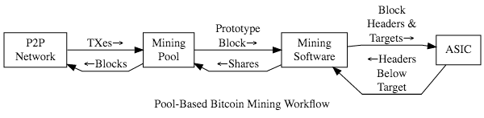

# Enervator

(Dr) Steven Huckle


- - -

# Blockchains


_Image Source: [The Economist, October 31 2015](https://www.economist.com/leaders/2015/10/31/the-trust-machine)_

- - -

## Overview

The _blockchain_ is a distributed, historical record of all data ever recorded on the network

## Key Technology

+ Distributed Systems
+ Consensus
+ Cryptography

## Distributed Computer Systems

+ **Peer-to-peer** - A network where its participants are both resource providers and resource requesters
+ **Decentralised**
	+ Architecturally
	 	+ Fault tolerance
		+ Attack resistance
		+ Collusion resistance
 	+ Politically - Control is not ceded to one individual or organisation
+ **Distributed** - A decentralised system that is logically centralised

## Consensus

Protocols that define how global agreement is reached in a distributed system

## Cryptography

The mathematics of information security.

+ **Public-key Cryptography (PKC)** - A form of encryption that creates a public key, which is shared, widely, and a private key, which is known only to the owner
+ **Cryptographic Hash Functions** - Maps arbitrary data to a unique fixed-size string
+ **Digital Signatures** - Identity authentication that allows users to digitally sign their messages

## Bitcoin

Bitcoin is called a _cryptocurrency_ because it is a form of electronic currency that relies on cryptographic techniques. It was introduced in Satoshi Nakamoto's white paper, [Bitcoin: A Peer-to-Peer Electronic Cash System ](https://bitcoin.org/bitcoin.pdf)

## The Purpose of Bitcoin

[Bitcoin](https://bitcoin.org/en/) is a peer-to-peer network whose overriding purpose is the propagation of any _transactions_ requiring validation

## Transactions

Transactions are owners of _Bitcoins_ transferring ownership. New owners can authorises those transactions' ongoing transfer, forming a chain of ownership - a _blockchain_


_Image Source: [Bitcoin: A Peer-to-Peer Electronic Cash System by Satoshi Nakamoto](https://bitcoin.org/bitcoin.pdf "Bitcoin White Paper")_

## Transactions (cont'd)

Paying with [Bitcoin](https://bitcoin.org/en/) means creating a record of a new _transaction_

## Blocks


_Image Source: [Bitcoin: A Peer-to-Peer Electronic Cash System](https://bitcoin.org/bitcoin.pdf "Bitcoin White Paper") by Satoshi Nakamoto_

## Mining (Consensus)

_Miners_ on the network [Bitcoin](https://bitcoin.org/en/) use computing power to solve computationally intensive cryptographic puzzles that verify _blocks_ of transactions using _Proof of Work_ consensus. The process is known as _mining_ because the network rewards the P2P node that successfully solves that problem with 'mined' [Bitcoin](https://bitcoin.org/en/). Hence, mining is also the process by which the system adds new coins to the network.

## Mining (cont'd)

The block is broadcast so that network nodes can decide on its validity



_Source: [bitcoin.org](http://bitcoin.org)_

## Ethereum

Key blockchain features _plus_ **programmability** in the form of _smart contracts_, which are autonomous scripts that represent verifiable application logic on the blockchain. [Enervator](https://github.com/glowkeeper/Enervator) takes advantage of that ability

# Introducing Enervator


_Image Source: [Clipart Library](http://clipart-library.com/clipart/1071253.htm)_

- - -

## The Energy Use of CryptoCurrencies


_Image Source: [CBC](https://www.cbc.ca/news/canada/montreal/magog-halts-bitcoin-mining-projects-over-energy-supply-concerns-1.4605041)_

## Counter Culture?


_Image Source: [The Daily Star](https://www.thedailystar.net/literature/news/karl-marx-india-assessment-part-ii-1683082)_

## Circular Economy?


_Image Source: [STARSINSIDER](https://www.starsinsider.com/food/200230/a-greenhouse-full-of-crypto-tomatoes-is-being-heated-by-bitcoin-computers)_

##

[Enervator](https://github.com/glowkeeper/Enervator) (EOR) is a proof of concept for a cryptocurrency that incentivises energy efficiency

## World Population

At 2.34pm GMT on September 2nd, 2019: _7727623693_

## Global Average Per Capita Energy Consumption (GAPCEC)

In 2014: _22.36 MWh_

## Total Primary Energy Supply (TPES)

In 2016: _162494360000 MWh_

## Global Average Residential Electricity Price

In 2017: _US$98.16 per MWh_

## EOR Value - GAPCEC


## EOR Value - GAPCEC Rising


## EOR Value - GAPCEC Falling


## EOR Value - TPES Rising


## EOR Value - TPES Falling


# The Code


_Image Source: [Clipart Library](http://clipart-library.com/clipart/1742722.htm)_

- - -

## Enervator Classes


## Enerchanger Classes


## The Enervator Token

+ [OpenZeppelin ERC777](https://docs.openzeppelin.com/contracts/2.x/api/token/erc777)
+ Rinkeby address [0x5483b2996BBa07330E188Fe10BB101d4c1Ac8530](https://rinkeby.etherscan.io/token/0x5483b2996bba07330e188fe10bb101d4c1ac8530)

## Smart Contracts

```
function _setUnitValue () private
{
  require (values.pricePerMWh > 0, "pricePerMWh invalid");
  require (values.currentTPES > 0, "currentTPES invalid");
  require (values.oldTPES > 0, "oldTPES invalid");
  require (values.perCapitaEnergy > 0, "perCapitaEnergy invalid");

  int128 TPESFactor = ABDKMath64x64.div(values.oldTPES, values.currentTPES);
  int128 prePrice =  ABDKMath64x64.div(TPESFactor, values.perCapitaEnergy);
  values.unitValue = ABDKMath64x64.mul(prePrice, values.pricePerMWh);
}
```

# Demo


_Image Source: [Clipart Library](http://clipart-library.com/clipart/1804638.htm)_

- - -

## GAPCEC Falls to 10 MWh

<video controls=true src="http://localhost:8000/videos/tenMWh.m4v"></video>

## £1000 to EOR

<video controls=true src="http://localhost:8000/videos/thousandPounds.m4v"></video>

## Demo' on GitHub

[Enervator](https://github.com/glowkeeper/Enervator): https://github.com/glowkeeper/Enervator

# The Future


_Image Source: [Clipart Library](http://clipart-library.com/clipart/2083841.htm)_

- - -

## Improve the Algorithm

[Enervator](https://github.com/glowkeeper/Enervator) could incentivise renewable energy, too...

## Network Effects

A West Sussex Cryptocurrency?

# Links

+ [Bitcoin White Paper](https://bitcoin.org/bitcoin.pdf): https://bitcoin.org/bitcoin.pdf
+ [Enervator](https://github.com/glowkeeper/Enervator): https://github.com/glowkeeper/Enervator
+ [This presentation](https://github.com/glowkeeper/Enervator/blob/master/presentations/nerdNite/presentation/nerdNite.md): https://tinyurl.com/shtpv57
+ [Socialism and the Blockchain](http://dx.doi.org/10.3390/fi8040049): http://dx.doi.org/10.3390/fi8040049
+ [The Conversation](https://tinyurl.com/y4ep8ygy): https://tinyurl.com/y4ep8ygy

- - -

# Thank You

w: [glowkeeper.github.io](https://glowkeeper.github.io/)

e: steve.huckle@gmail.com or s.huckle@sussex.ac.uk
